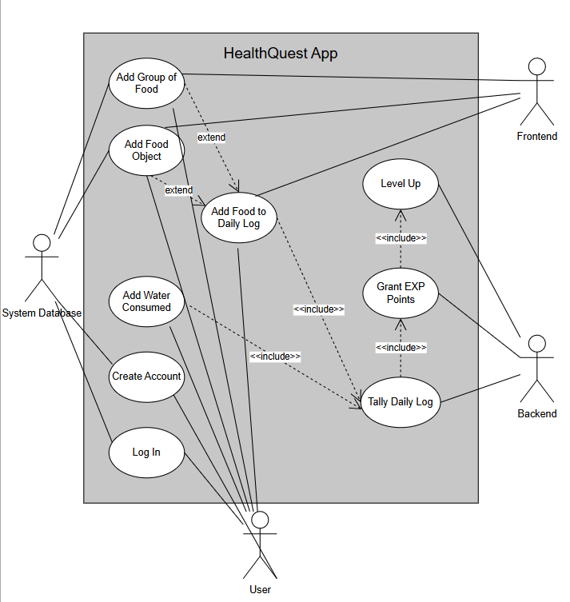

# HealthQuest
### EECS 3311 E F24 | Group 6

## About our App

HealthQuest is a personal health tracker app that is designed to help users along their fitness journey. The app will track daily calories, vitamins and nutrients by having the user 
input a food object, while motivating users to challenge themselves to attain a healthier lifestyle.  The app offers a "video game"-like progression system with a character builder,
level and experience points to help further motivate the user to achieve their health goals.

## Health Tracking Features
### How do we track calories and nutrition?

A food object represents the food you eat by calories and nutrients. Once a food object has 
been added, it will become a visible item to select again, so the user does not need to 
reinput nutrition and calorie data for that food again.  Users can also specify a group food 
object, which will allow them to add a whole meal as one selectable object.  Users can also 
select from a handful of predefined food options for ease of use, in case the food they 
select already exists.

### About the Character Builder and EXP

When you first log in, you'll be prompted to create a character.  This character serves as
your avatar along your fitness journey.  Experience can be gained by fulfilling daily nutrient
levels and staying within the target calorie range for the day.  Experience will be added to 
your total Level, which describes how adept you are at meeting these challenges.  This level
progression system, found in many other games is a great way to keep people motivated and
actively trying to gain experience points to "level up".

### Key Personas

Based on the multiple different [personas](personas.pdf) listed in the PDF, some of the key personas we 
identified are Jack and Hannah.  

Jack is a young man who enjoys video games and is looking to get healthier.  HealthQuest 
provides the perfect solution, by gameifying calorie counting and health tracking metrics.
The simplicity and ease of use means Jack can easily input calories after meals without 
intruding into his busy work schedule.  The game-like experience keeps Jack interested, 
making it feel exciting and fun to track his calories and nutrients.

Hannah is a teenage girl who is proficient with technology.  Despite the app's ease of use,
technology proficiency and making use of the experience system will bring out the most
of the app experience, so Hannah is another great example of a key persona.  Keeping track
of her protein and water intake are features the app plans to tackle, which line up well with
her goals.  Hannah will be able to take full advantage of the app and gain experience points
fast since she plans to hit her goals often for the sake of soccer practices.

## Use Cases

We have designed a simple Use Case diagram to illustrate how the users, backend, frontend and
database system actors interact with the HealthQuest app system.  (Subject to change).

### Use Scenarios

Let's go over a few key scenarios the app is planned to be used for.

#### The Minimalist
The Minimalist uses the app for it's basic nutrition and calorie-tracking features.  They
create a basic profile with the character creator so they can jump right into tracking. 
The Minimalist is not concerned with experience points or levels, as they just need a basic
health tracker to suit their needs.  They are able to use the core functionalities of the app
without compromising too much on their experience.

#### The Video Game Enthusiast
The Enthusiast plays a lot of games in their spare time.  They are familiar with basic video
game design principles and enjoy gaming as a hobby.  They were looking for a product to 
"gameify" their life for the purpose of a healthier lifestyle.  They pour a lot of time and
effort into the character developer and are motivated to take on new challenges to gain exp
and outdo their friends.  Their competitive nature, love for gaming and desire to get 
healthier allows them to unlock the full potential of the app and its features.

## Desired Features
### Features we would like to add post-release of V1

Some desired features that we would like to add after a V1 release (not to be included in the final project):
- Graphed data to show the trends over a 30-day period
- The ability to connect with other users, to allow friends to compete in daily challenges and for higher levels
- AI-based analytics to track current progress and predict future trends, allowing for a more natural level-scaling
- AI-bsaed analytics to provide a more detailed analysis on current health habits and improvements that can be made
- A rewards system to reward users for completing tasks and leveling up
- An internal RPG built into the app, where you can take your character on a quest
- Rewards for the RPG, so you can spend points on magic spells, weapons, armor, etc.